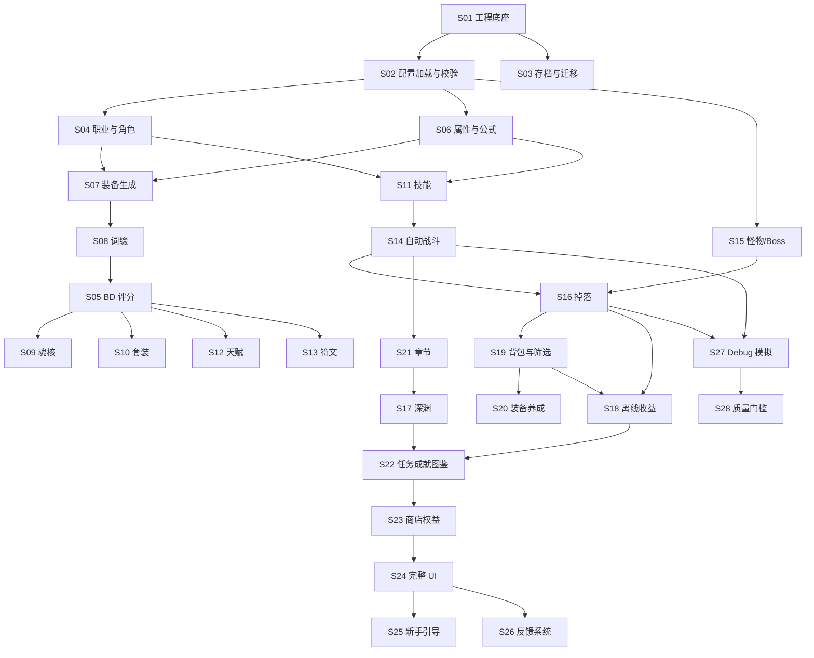

# 《深渊遗装》v1.0 开发需求拆解

本文将 `深渊遗装_v1.0_Codex系统开发文档包` 拆解为可独立领取的开发需求草案。格式遵循 `to-issues` 技能：每个条目尽量是可验证的 tracer bullet，完成后应留下一个可启动、可测试、可演示的窄闭环。

当前仓库尚未配置 GitHub Issues 或本地 issue tracker，因此本文先作为待确认的 issue 草案。确认后可逐条发布到正式 issue tracker。

## 拆解原则

- 每个需求必须保持数据驱动，内容来自 `assets/data/*.json`，逻辑写在 service/system 层。
- UI 不直接修改模型，不直接计算战斗、属性、掉落或收益。
- 每个需求完成后必须更新 `CHANGELOG_DEV.md`。
- 每个核心 service 必须有单元测试或可执行验收测试。
- 优先跑通最小闭环，再扩完整内容量。
- 需求类型：
  - `AFK`：可由代理独立实现和验证。
  - `HITL`：需要人工确认方向、视觉、商业边界或架构取舍。

## 总体依赖地图

---

## Milestone 1: 正式工程底座

### Issue 001: 创建 Flutter 正式工程底座

**Type:** AFK

**Blocked by:** None - can start immediately

**User stories covered:** 作为开发者，我需要一个正式项目结构，后续系统可以稳定扩展。

**What to build**

创建 Flutter/Dart 工程底座，建立 `lib/core`、`lib/models`、`lib/systems`、`lib/features`、`lib/data`、`lib/ui`、`assets/data`、`test` 等目录。接入基础 App 入口、暗黑主题、路由壳、底部 5 个主 Tab 占位页：战斗、装备、BD、深渊、角色。创建 `CHANGELOG_DEV.md` 模板。

**Acceptance criteria**

- [ ] App 可以启动到主界面。
- [ ] 底部 5 个 Tab 可以切换且不崩溃。
- [ ] `assets/data` 已在 `pubspec.yaml` 注册。
- [ ] Debug 入口只在 debug mode 可见。
- [ ] `CHANGELOG_DEV.md` 存在，并记录本次新增/修改文件。
- [ ] smoke test 验证 App 可以构建主界面。

### Issue 002: 建立应用路由、导航状态与页面壳

**Type:** AFK

**Blocked by:** Issue 001

**User stories covered:** 作为玩家，我需要在战斗、装备、BD、深渊、角色页之间稳定切换。

**What to build**

实现统一的 `AppRoute`、`NavigationService` 或等价导航状态。页面壳负责主 Tab 切换，业务页面先使用空状态 ViewModel，不引入玩法逻辑。路由 id 使用 snake_case 英文。

**Acceptance criteria**

- [ ] 5 个主页面都有稳定 route id。
- [ ] 页面切换不会重建导致异常状态。
- [ ] 导航层不直接依赖战斗、装备等业务服务。
- [ ] Widget test 覆盖 Tab 切换。

### Issue 003: 实现全局暗黑主题与品质色规范

**Type:** HITL

**Blocked by:** Issue 001

**User stories covered:** 作为玩家，我需要界面符合暗黑挂机刷宝气质，并能直观看到装备品质差异。

**What to build**

定义 `AppTheme` 和 `QualityTheme`，包含背景色、卡片色、按钮、弹窗、文本层级、装备品质色。先实现可用的暗黑视觉规范，后续 UI 迭代不破坏主题接口。

**Acceptance criteria**

- [ ] App 使用统一暗黑主题。
- [ ] 8 档品质都有明确颜色 token。
- [ ] 主题 token 不散落在页面里。
- [ ] 人工确认首版视觉方向可接受。

### Issue 004: 建立开发日志与系统完成模板

**Type:** AFK

**Blocked by:** Issue 001

**User stories covered:** 作为开发者，我需要每个系统完成后能追踪新增文件、测试和遗留问题。

**What to build**

完善 `CHANGELOG_DEV.md` 模板，包含系统编号、日期、新增文件、修改文件、完成内容、测试结果、存档影响、待处理问题。可选增加 `docs/dev/checklist_template.md`。

**Acceptance criteria**

- [ ] 模板覆盖文档要求的输出项。
- [ ] Issue 001-004 的工作被记录。
- [ ] 后续系统能复制同一格式追加。

---

## Milestone 2: 配置加载、校验与示例数据

### Issue 005: 实现通用 JSON 配置加载器

**Type:** AFK

**Blocked by:** Issue 001

**User stories covered:** 作为开发者，我需要启动时加载所有本地 JSON 配置。

**What to build**

实现 `DataLoader`，支持从 `assets/data/*.json` 读取配置文件，解析 JSON，返回带文件名、schemaVersion、记录数量、原始数据的结果。加载错误必须结构化返回，不静默失败。

**Acceptance criteria**

- [ ] 正常 JSON 可读取。
- [ ] 缺失文件返回明确错误。
- [ ] 非法 JSON 返回明确错误。
- [ ] 单元测试覆盖成功、缺失、格式错误。

### Issue 006: 实现 GameDatabase 聚合访问层

**Type:** AFK

**Blocked by:** Issue 005

**User stories covered:** 作为系统开发者，我需要通过统一入口访问职业、技能、装备、词缀等配置。

**What to build**

创建 `GameDatabase` 和 `GameDatabaseService`，聚合各配置表。首版接入 `classes`、`skills`、`affixes`、`equipment_templates`、`difficulties`、`soul_cores` 示例数据。

**Acceptance criteria**

- [ ] `GameDatabase` 提供按 id 查询能力。
- [ ] 查询不存在 id 时返回可处理结果，不抛未处理 null。
- [ ] Debug 页可显示配置文件数量、记录数量。
- [ ] 测试验证正常配置可构建数据库。

### Issue 007: 实现配置 schemaVersion 与必填字段校验

**Type:** AFK

**Blocked by:** Issue 006

**User stories covered:** 作为开发者，我需要配置字段变化时能及时发现错误。

**What to build**

实现 `ConfigValidator`，检查每个 JSON 根对象的 `schemaVersion`，检查记录必填字段：`id`、`name`、类型字段、标签字段等。先按文档现有 schema 和示例数据实现基础校验。

**Acceptance criteria**

- [ ] 缺少 `schemaVersion` 能被检测。
- [ ] 缺少 `id` 或重复 `id` 能被检测。
- [ ] 错误包含文件名、记录 id、字段名、严重程度。
- [ ] Debug 页可展示错误列表。

### Issue 008: 实现跨表引用完整性检查

**Type:** AFK

**Blocked by:** Issue 007

**User stories covered:** 作为开发者，我需要装备引用词缀、技能引用效果、掉落引用装备时能发现无效引用。

**What to build**

实现 `ReferenceResolver` 和 `ReferenceCheckResult`，首版检查装备模板引用套装/词缀标签、掉落池引用装备/材料/符文/魂核、技能/词缀/魂核 effectId 是否进入已知 effect registry。

**Acceptance criteria**

- [ ] 无效引用能被检测。
- [ ] 严重引用错误阻止进入主界面或进入安全错误页。
- [ ] Debug 页按文件筛选错误。
- [ ] 单元测试覆盖无效引用、正常引用。

### Issue 009: 建立最小可玩示例配置集

**Type:** AFK

**Blocked by:** Issue 007

**User stories covered:** 作为开发者，我需要用少量真实配置跑通最小闭环，而不是空壳 Demo。

**What to build**

基于 `05_示例数据` 创建 `assets/data` 的首批示例配置：全部 5 个职业、每职业少量示例技能、10-20 个通用/职业词缀、基础装备模板、品质配置、怪物、掉落池、第 1 章、普通难度、1 个魂核。

**Acceptance criteria**

- [ ] 示例数据全部通过配置校验。
- [ ] id 使用 snake_case 英文。
- [ ] 展示名可使用中文。
- [ ] 5 个职业均可创建，并具备基础属性、成长、标签。
- [ ] 示例内容足够支撑角色创建、战斗、掉落、穿戴。

---

## Milestone 3: 存档与版本迁移

### Issue 010: 实现 SaveData 根结构与首次启动新档

**Type:** AFK

**Blocked by:** Issue 001

**User stories covered:** 作为玩家，我首次打开游戏时应自动拥有一个可保存的新存档。

**What to build**

定义 `SaveData`、`PlayerProgress`、`InventorySave`、`SettingsSave` 等根结构，包含 `saveVersion`、创建时间、最后保存时间、当前角色、章节/深渊进度、设置占位。首次启动无存档时创建默认存档。

**Acceptance criteria**

- [ ] 首次启动自动创建新存档。
- [ ] 存档包含 `saveVersion`。
- [ ] 存档结构支持 `toJson/fromJson`。
- [ ] 单元测试覆盖新档创建和序列化往返。

### Issue 011: 实现本地 SaveService 读写删除

**Type:** AFK

**Blocked by:** Issue 010

**User stories covered:** 作为玩家，我的角色、背包和进度应在重启后保留。

**What to build**

选择 Hive 或轻量本地 JSON/文件存储方案作为 v1 首版存档实现。实现 `load`、`save`、`delete`，关键操作后可调用保存。保留未来多存档位接口。

**Acceptance criteria**

- [ ] 保存后重启可读取同一数据。
- [ ] 删除存档后再次启动创建新档。
- [ ] 读写异常不会导致白屏。
- [ ] 测试覆盖读写删除。

### Issue 012: 实现存档备份、损坏恢复与迁移示例

**Type:** AFK

**Blocked by:** Issue 011

**User stories covered:** 作为玩家，我的存档损坏或版本升级时不应直接丢失。

**What to build**

实现 `BackupService` 和 `SaveMigrationService`。保存前/后保留最近备份。提供 `v1 -> v2` 示例迁移，损坏主存档时优先尝试最近备份。

**Acceptance criteria**

- [ ] 损坏主存档时尝试加载备份。
- [ ] 旧版本存档可迁移到当前版本。
- [ ] 迁移结果包含成功、警告、失败信息。
- [ ] migration 测试覆盖旧版本样例。

### Issue 013: 接入应用生命周期自动保存

**Type:** AFK

**Blocked by:** Issue 011

**User stories covered:** 作为玩家，我退出或进入后台后进度应尽量不丢失。

**What to build**

实现 `AutoSaveService` 或应用生命周期监听。进入后台、退出、关键操作后触发保存。首版可对关键服务暴露显式 save hook。

**Acceptance criteria**

- [ ] 进入后台时记录 `lastExitTime`。
- [ ] 关键操作后可触发保存。
- [ ] 自动保存失败有 Debug 可见错误。
- [ ] 不因频繁保存明显卡顿。

---

## Milestone 4: 角色、职业与属性公式

### Issue 014: 实现职业配置与角色创建

**Type:** AFK

**Blocked by:** Issue 006, Issue 010

**User stories covered:** 作为玩家，我可以创建职业角色并看到基础属性。

**What to build**

实现 `ClassConfig`、`CharacterState`、`ClassService`、`CharacterService`。从 `classes.json` 创建角色，支持职业 id、等级、经验、基础属性、职业标签。首批必须包含文档定义的 5 个职业：流放者、亡语者、灰烬术士、冰痕猎手、圣裁者。

**Acceptance criteria**

- [ ] 每个配置职业可创建角色。
- [ ] 职业 id 与展示名分离。
- [ ] 角色状态能保存并恢复。
- [ ] 测试覆盖职业创建和无效职业 id。

### Issue 015: 实现等级成长和经验曲线

**Type:** AFK

**Blocked by:** Issue 014

**User stories covered:** 作为玩家，我获得经验后等级提升，基础属性成长。

**What to build**

实现 `LevelCurve`、`LevelService`，读取 `level_curves.json` 或首版公式配置。升级提供基础属性和系统解锁输入，但不得压过装备价值。

**Acceptance criteria**

- [ ] 经验达到阈值后升级。
- [ ] 升级后基础属性按成长变化。
- [ ] 多级升级可正确处理。
- [ ] 测试覆盖边界经验值。

### Issue 016: 实现 StatBlock 与属性聚合基础

**Type:** AFK

**Blocked by:** Issue 014

**User stories covered:** 作为玩家，我穿戴装备、学习天赋后最终属性应稳定计算。

**What to build**

实现 `StatBlock`、`ComputedStats`、`StatAggregationService`。支持 flat、percent、more、less 叠加顺序。首版聚合职业基础、等级成长、装备基础属性、词缀属性。

**Acceptance criteria**

- [ ] flat 与 percent 叠加顺序正确。
- [ ] more/less 可叠乘。
- [ ] 负面属性不会产生 NaN。
- [ ] Debug 可查看基础、装备、最终属性拆解。

### Issue 017: 实现伤害、暴击、抗性与软上限公式

**Type:** AFK

**Blocked by:** Issue 016

**User stories covered:** 作为玩家，我的攻击、暴击和抗性变化应影响战斗结果。

**What to build**

实现 `DamageFormulaService`、`DamageContext`、`DamageResult`，公式参数来自 `formula_config.json`。支持普通伤害、暴击率封顶、暴击伤害、抗性减伤、护甲减伤。

**Acceptance criteria**

- [ ] 暴击率软/硬上限生效。
- [ ] 怪物抗性正确降低伤害。
- [ ] 伤害结果包含是否暴击、最终伤害、拆解信息。
- [ ] 公式测试使用确定性输入。

---

## Milestone 5: 装备、品质、词缀与 BD 评分

### Issue 018: 实现装备部位、品质和模板模型

**Type:** AFK

**Blocked by:** Issue 006

**User stories covered:** 作为开发者，我需要用配置定义装备部位、品质和模板。

**What to build**

实现 `EquipmentSlot`、`EquipmentQuality`、`EquipmentTemplate`、`QualityService`。支持文档定义的 12 个装备位和 8 档品质，品质影响颜色、词缀数量、数值范围和特效概率。

**Acceptance criteria**

- [ ] 12 个装备位可表达，戒指双槽预留。
- [ ] 8 档品质可从配置读取。
- [ ] 装备模板与装备实例分离。
- [ ] 测试覆盖模板解析和品质查询。

### Issue 019: 实现装备实例生成

**Type:** AFK

**Blocked by:** Issue 016, Issue 018

**User stories covered:** 作为玩家，我击杀怪物后可以获得随机属性的装备实例。

**What to build**

实现 `EquipmentGenerationService`，按模板、等级、品质、职业、随机种子生成 `EquipmentInstance`。实例包含稳定 `instanceId`、模板 id、品质、rolled base stats、rolled affixes、创建时间。

**Acceptance criteria**

- [ ] 每件装备拥有唯一 instanceId。
- [ ] 同模板多次生成属性或词缀可不同。
- [ ] 生成结果可保存并恢复。
- [ ] 测试覆盖确定性 seed 和随机范围。

### Issue 020: 实现装备穿戴、卸下与职业限制

**Type:** AFK

**Blocked by:** Issue 019

**User stories covered:** 作为玩家，我可以穿戴符合职业和等级限制的装备。

**What to build**

实现 `EquipmentService`，处理穿戴、卸下、替换、职业限制、等级限制、戒指 1/2 槽逻辑、魂核特殊槽预留。

**Acceptance criteria**

- [ ] 职业不符不能穿戴。
- [ ] 等级不足不能穿戴。
- [ ] 戒指 1/2 能同时装备两枚戒指。
- [ ] 穿戴后属性聚合变化。

### Issue 021: 实现词缀配置、随机与互斥

**Type:** AFK

**Blocked by:** Issue 019

**User stories covered:** 作为玩家，我获得的装备应带有符合等级、权重和互斥规则的随机词缀。

**What to build**

实现 `AffixConfig`、`AffixRollService`、`AffixGroupRule`。根据等级、允许标签、权重、互斥组 roll 词缀数值。自然语言描述只用于展示，不用于逻辑判断。

**Acceptance criteria**

- [ ] roll 数值在范围内。
- [ ] 低等级不会出现高等级词缀。
- [ ] 同一互斥组不会同时出现。
- [ ] 标签筛选可命中对应词缀。

### Issue 022: 实现词缀效果解析入口

**Type:** AFK

**Blocked by:** Issue 021

**User stories covered:** 作为玩家，机制词缀应能改变属性或战斗事件。

**What to build**

实现 `AffixEffectResolver`，将 `effectId + params` 注册到效果处理器。首版支持属性类、状态类、事件触发类入口，未实现 effectId 以明确警告显示。

**Acceptance criteria**

- [ ] 属性词缀能进入属性聚合。
- [ ] 机制词缀能注册到事件系统预留。
- [ ] 未知 effectId 有 Debug 警告。
- [ ] 不通过自然语言描述驱动逻辑。

### Issue 023: 实现 BD 标签聚合与构筑识别

**Type:** AFK

**Blocked by:** Issue 020, Issue 022

**User stories covered:** 作为玩家，我能看到当前装备和技能倾向于哪种 BD。

**What to build**

实现 `BuildConfig`、`BuildService`。从职业、技能、装备、词缀、魂核、套装、天赋、符文聚合标签。首版先接入职业、装备、词缀、技能。

**Acceptance criteria**

- [ ] 毒伤装备能提高 poison/shadow 类 BD 倾向。
- [ ] 召唤标签能识别亡灵/召唤流派。
- [ ] 无明显标签时显示混合构筑。
- [ ] 混合 BD 不被强行归类。

### Issue 024: 实现 BD 匹配度和装备评分

**Type:** AFK

**Blocked by:** Issue 023

**User stories covered:** 作为玩家，我能判断一件装备是否适合当前 BD，而不是只看战力。

**What to build**

实现 `BuildScoreService` 和 `EquipmentCompareService`。评分考虑核心标签、次级标签、排斥标签、机制词缀、当前缺口。与纯战力评分分离。

**Acceptance criteria**

- [ ] 装备评分不会只按攻击/生命排序。
- [ ] 排斥标签会降低匹配度。
- [ ] 装备详情可显示当前 BD 匹配度。
- [ ] 测试覆盖毒伤、召唤、混合构筑样例。

---

## Milestone 6: 技能、怪物与自动战斗

### Issue 025: 实现技能配置、技能槽与冷却

**Type:** AFK

**Blocked by:** Issue 014, Issue 017

**User stories covered:** 作为玩家，我可以配置技能，让角色自动释放。

**What to build**

实现 `SkillConfig`、`SkillInstance`、`SkillSlot`、`CooldownService`。每个角色支持 3 主动、3 被动、1 终结技能。技能配置来自 `skills.json`。

**Acceptance criteria**

- [ ] 主动、被动、终结技能类型可区分。
- [ ] 冷却未完成不能释放。
- [ ] 资源不足不能释放。
- [ ] 被动技能不主动释放但可提供效果。

### Issue 026: 实现技能释放条件和自动优先级

**Type:** AFK

**Blocked by:** Issue 025

**User stories covered:** 作为玩家，我不用高频点击，角色能按条件自动释放技能。

**What to build**

实现 `SkillCastService`、`SkillPriorityService`、`SkillCastCondition`。支持 always、low_hp、enemy_status 等条件和优先级排序。

**Acceptance criteria**

- [ ] 低血治疗/护盾技能只在条件满足时释放。
- [ ] 多技能可按优先级选择。
- [ ] 技能释放结果进入战斗日志。
- [ ] 修改链防止无限递归。

### Issue 027: 实现怪物实例生成

**Type:** AFK

**Blocked by:** Issue 006, Issue 017

**User stories covered:** 作为玩家，我在章节或深渊中会遇到配置化怪物。

**What to build**

实现 `MonsterConfig`、`EnemyInstance`、`EnemyGenerationService`。怪物属性受等级、章节、层数、难度倍率影响。先支持普通怪。

**Acceptance criteria**

- [ ] 普通怪可从配置生成。
- [ ] 怪物 HP/攻击受倍率影响。
- [ ] 怪物抗性参与伤害公式。
- [ ] 测试覆盖不同等级/难度生成。

### Issue 028: 实现精英词缀与 Boss 阶段

**Type:** AFK

**Blocked by:** Issue 027

**User stories covered:** 作为玩家，我会遇到有词缀和阶段机制的精英怪/Boss。

**What to build**

实现 `EliteAffixService`、`BossConfig`、`BossPhase`、`BossService`。精英词缀可叠加但有上限，Boss 低血进入阶段，难度可增加 extraMechanics。

**Acceptance criteria**

- [ ] 精英词缀能改变属性或触发效果。
- [ ] 精英词缀数量受难度限制。
- [ ] Boss 低血进入二阶段。
- [ ] 多死亡爆炸类效果有触发频率限制。

### Issue 029: 实现固定 tick 自动战斗循环

**Type:** AFK

**Blocked by:** Issue 026, Issue 027

**User stories covered:** 作为玩家，角色应自动攻击、释放技能并产生胜负。

**What to build**

实现 `BattleState`、`Combatant`、`BattleLoopService`，使用固定步长 tick。支持普通攻击、技能释放、HP 变化、胜负判断。

**Acceptance criteria**

- [ ] 角色能自动打死低级怪。
- [ ] 怪物能打死角色。
- [ ] tick 不依赖 Widget 生命周期。
- [ ] 1000 tick 不崩溃。

### Issue 030: 实现战斗事件总线、状态效果与日志截断

**Type:** AFK

**Blocked by:** Issue 029

**User stories covered:** 作为开发者，我需要统一处理词缀、魂核、套装等战斗触发效果。

**What to build**

实现 `CombatEventBus`、`StatusEffectInstance`、`BattleLogService`。所有触发效果走事件总线。状态持续时间随 tick 减少，日志只保留最近 N 条。

**Acceptance criteria**

- [ ] 状态持续时间正确减少。
- [ ] 怪物死亡事件可被掉落系统监听。
- [ ] 战斗日志不会无限增长。
- [ ] 事件总线不依赖 UI。

---

## Milestone 7: 掉落、背包与装备管理

### Issue 031: 实现 DropContext 和基础掉落池

**Type:** AFK

**Blocked by:** Issue 019, Issue 030

**User stories covered:** 作为玩家，击杀怪物后应根据场景获得奖励。

**What to build**

实现 `DropPoolConfig`、`DropEntry`、`DropContext`、`DropService`。上下文包含章节、深渊领域、难度、层数、怪物类型、玩家掉落加成。

**Acceptance criteria**

- [ ] 普通怪可从掉落池产出奖励。
- [ ] Boss 可使用更高品质权重。
- [ ] 掉落结果包含装备、材料、金币等类型。
- [ ] 无效掉落引用被配置校验发现。

### Issue 032: 实现品质权重、Magic Find 与首通奖励

**Type:** AFK

**Blocked by:** Issue 031

**User stories covered:** 作为玩家，提高难度或首通 Boss 应提升奖励体验。

**What to build**

实现 `QualityRollService`、`RewardService`。品质先 roll，再 roll 具体装备池。支持难度 qualityBonus、Magic Find、Boss 专属掉落、首通奖励只领取一次。

**Acceptance criteria**

- [ ] 高难度提高传奇/神话/深渊权重。
- [ ] 首通奖励只发一次。
- [ ] 职业装备权重高于其他职业但允许通用掉落。
- [ ] 掉落模拟可统计品质分布。

### Issue 033: 实现背包装备与材料堆叠

**Type:** AFK

**Blocked by:** Issue 011, Issue 031

**User stories covered:** 作为玩家，我获得的装备和材料应进入背包并可持久保存。

**What to build**

实现 `InventoryState`、`InventoryService`、`MaterialStack`。装备占装备容量，材料堆叠不占装备格。接入掉落结果。

**Acceptance criteria**

- [ ] 装备掉落进入背包。
- [ ] 材料按 id 堆叠。
- [ ] 背包状态可保存恢复。
- [ ] 背包满时不会崩溃。

### Issue 034: 实现装备锁定、一键分解与分解收益

**Type:** AFK

**Blocked by:** Issue 033

**User stories covered:** 作为玩家，我可以锁定潜力装备并快速清理垃圾装备。

**What to build**

实现 `SalvageService`。锁定装备不可分解。一键分解按品质、标签、规则筛选。分解产出材料。

**Acceptance criteria**

- [ ] 锁定装备不会被一键分解。
- [ ] 分解后装备移除、材料增加。
- [ ] 分解规则可配置或可保存。
- [ ] 测试覆盖锁定和分解收益。

### Issue 035: 实现自动保留、自动分解与筛选模板

**Type:** AFK

**Blocked by:** Issue 024, Issue 034

**User stories covered:** 作为玩家，离线或挂机时系统能自动保留适合 BD 的装备。

**What to build**

实现 `FilterRule`、`FilterService`、`AutoLootService`。自动筛选优先级为：锁定 > 保留规则 > 分解规则。支持 BD 模板，如毒伤模板保留毒相关词缀。

**Acceptance criteria**

- [ ] 自动保留传奇。
- [ ] 毒伤模板保留毒相关词缀。
- [ ] 自动分解结果可展示在离线收益页。
- [ ] 筛选规则保存到存档。

### Issue 036: 实现仓库与容量扩展

**Type:** AFK

**Blocked by:** Issue 033

**User stories covered:** 作为玩家，我可以把重要装备移动到仓库，并通过权益扩展容量。

**What to build**

实现 `StorageState`、`StorageService`，支持背包与仓库移动、容量配置、未来商店权益扩容接口。

**Acceptance criteria**

- [ ] 装备可在背包和仓库间移动。
- [ ] 容量限制生效。
- [ ] 仓库状态可保存恢复。
- [ ] 扩容接口可被商店权益调用。

---

## Milestone 8: 章节与最小刷宝闭环

### Issue 037: 实现章节配置、阶段进度与重复刷

**Type:** AFK

**Blocked by:** Issue 029, Issue 031

**User stories covered:** 作为玩家，我可以进入普通章节推进，并重复刷章节获得基础掉落。

**What to build**

实现 `ChapterConfig`、`StageConfig`、`ChapterProgress`、`ChapterService`。首版跑通第 1 章：进入阶段、生成怪物、胜利推进、重复刷已通关阶段。

**Acceptance criteria**

- [ ] 第 1 章可进入。
- [ ] 通关阶段后进度保存。
- [ ] 重复刷章节可获得掉落。
- [ ] 章节页可显示进度、Boss、掉落主题。

### Issue 038: 实现章节 Boss、首通奖励与系统解锁事件

**Type:** AFK

**Blocked by:** Issue 037

**User stories covered:** 作为玩家，击败章节 Boss 后应获得首通奖励并解锁新系统。

**What to build**

实现 `ChapterRewardService`、`UnlockCondition`、`UnlockService` 入口。章节 Boss 首通奖励只发一次，通关指定章节触发系统解锁。

**Acceptance criteria**

- [ ] Boss 首通奖励只给一次。
- [ ] 通关第 1 章可解锁指定系统。
- [ ] 未解锁系统入口置灰。
- [ ] 失败时可返回推荐强化/BD 建议占位。

### Issue 039: 打通首个端到端刷宝演示流

**Type:** AFK

**Blocked by:** Issue 020, Issue 024, Issue 033, Issue 037

**User stories covered:** 作为玩家，我可以战斗、掉落、查看装备、穿戴装备并变强。

**What to build**

串联职业、技能、章节、战斗、掉落、背包、装备穿戴、属性聚合、BD 评分。提供一个可手动验收的端到端场景。

**Acceptance criteria**

- [ ] 创建角色后可进入第 1 章。
- [ ] 自动战斗胜利后获得装备。
- [ ] 装备可在背包查看并穿戴。
- [ ] 穿戴后属性和 BD 匹配度变化。
- [ ] 重启后角色和装备保留。

---

## Milestone 9: 装备养成、魂核、套装、天赋、符文

### Issue 040: 实现装备强化与材料消耗

**Type:** AFK

**Blocked by:** Issue 034

**User stories covered:** 作为玩家，我可以消耗材料强化装备基础属性。

**What to build**

实现 `EnhanceConfig`、`EnhanceService`、`MaterialCostService`。强化主要提升基础属性，消耗来自 `upgrade_config.json`。

**Acceptance criteria**

- [ ] 材料不足不能强化。
- [ ] 强化后装备基础属性提升。
- [ ] 强化等级保存到装备实例。
- [ ] 强化结果进入属性聚合。

### Issue 041: 实现装备洗练

**Type:** AFK

**Blocked by:** Issue 021, Issue 040

**User stories covered:** 作为玩家，我可以洗练装备的一条可洗词缀。

**What to build**

实现 `RerollService`。每次只洗一条可洗词缀，传奇核心效果不可洗，可预留词缀锁定。

**Acceptance criteria**

- [ ] 不可洗词缀不会变化。
- [ ] 洗练后新词缀仍符合等级和互斥规则。
- [ ] 材料不足不能洗练。
- [ ] 洗练结果可保存。

### Issue 042: 实现装备腐化

**Type:** AFK

**Blocked by:** Issue 022, Issue 040

**User stories covered:** 作为玩家，我可以用腐化换取强机制和负面代价。

**What to build**

实现 `CorruptionService` 和 `corruption_pools.json`。腐化可添加正面或负面效果，但首版不让核心装备永久消失。

**Acceptance criteria**

- [ ] 腐化结果来自配置池。
- [ ] 腐化能添加正面或负面效果。
- [ ] 腐化状态保存到装备实例。
- [ ] 腐化失败不会直接删除装备。

### Issue 043: 实现魂核穿戴与核心效果

**Type:** AFK

**Blocked by:** Issue 022, Issue 030

**User stories covered:** 作为玩家，我可以装备魂核，让 BD 机制发生改变。

**What to build**

实现 `SoulCoreConfig`、`SoulCoreInstance`、`SoulCoreService`、`SoulCoreEffectService`。魂核效果通过 `effectId + params` 触发，并进入 BD 标签。

**Acceptance criteria**

- [ ] 魂核可穿戴/卸下。
- [ ] 魂核卸下后效果消失。
- [ ] 瘟疫魂核可触发毒爆类效果。
- [ ] 魂核标签影响 BD 判断。

### Issue 044: 实现魂核冲突优先级与升级预留

**Type:** AFK

**Blocked by:** Issue 043

**User stories covered:** 作为玩家，多个核心机制冲突时应有确定结果。

**What to build**

实现魂核 effect priority 冲突处理，预留 `SoulCoreUpgradeService` 和等级配置，但首版可只支持读取等级。

**Acceptance criteria**

- [ ] 多个核心机制冲突按 priority 解决。
- [ ] 冲突结果可在 Debug 中查看。
- [ ] 魂核升级接口存在但不强行开放复杂养成。

### Issue 045: 实现套装件数统计与效果激活

**Type:** AFK

**Blocked by:** Issue 020, Issue 022

**User stories covered:** 作为玩家，我穿戴同套装备后应激活套装效果。

**What to build**

实现 `SetConfig`、`SetService`、`SetBonusService`。统计已穿戴套装件数，激活 2/3/4 件效果。

**Acceptance criteria**

- [ ] 穿 2 件激活 2 件效果。
- [ ] 卸下一件后效果取消。
- [ ] 同时穿多套可分别统计。
- [ ] 套装效果进入属性或事件系统。

### Issue 046: 实现套装图鉴收集状态

**Type:** AFK

**Blocked by:** Issue 045

**User stories covered:** 作为玩家，我能查看曾经获得过的套装收集进度。

**What to build**

实现 `SetCollectionState` 和套装图鉴记录。获得过的套装件点亮，不要求当前持有。

**Acceptance criteria**

- [ ] 获得套装件后图鉴点亮。
- [ ] 分解后图鉴仍保留记录。
- [ ] 图鉴状态可保存恢复。

### Issue 047: 实现天赋树点亮、前置与重置

**Type:** AFK

**Blocked by:** Issue 014, Issue 022

**User stories covered:** 作为玩家，我可以用天赋长期强化当前 BD。

**What to build**

实现 `TalentTreeConfig`、`TalentNode`、`TalentState`、`TalentService`。支持天赋点、前置节点、点亮、重置。首版 UI 可用列表/分组。

**Acceptance criteria**

- [ ] 点亮节点消耗天赋点。
- [ ] 未满足前置不可点。
- [ ] 重置后效果移除。
- [ ] 天赋效果影响属性或 BD 评分。

### Issue 048: 实现符文背包、槽位与镶嵌

**Type:** AFK

**Blocked by:** Issue 033, Issue 022

**User stories covered:** 作为玩家，我可以把符文镶嵌到符合条件的装备上。

**What to build**

实现 `RuneConfig`、`RuneInstance`、`RuneSlot`、`RuneService`、`RuneSocketService`。只有特定装备位有符文槽，不符合槽类型不可镶嵌。

**Acceptance criteria**

- [ ] 空槽可镶嵌。
- [ ] 不符合槽类型的符文不可镶嵌。
- [ ] 拆卸后效果取消。
- [ ] 符文效果进入属性、技能或掉落聚合。

---

## Milestone 10: 深渊、挂机与离线收益

### Issue 049: 实现深渊领域、难度和层数进度

**Type:** AFK

**Blocked by:** Issue 037

**User stories covered:** 作为玩家，我可以选择领域、难度和层数挑战终局内容。

**What to build**

实现 `AbyssDomainConfig`、`DifficultyConfig`、`AbyssProgress`、`AbyssService`。结构为领域 × 难度 × 层数，每领域 100 层。

**Acceptance criteria**

- [ ] 普通难度第 1 层可进入。
- [ ] 未通关前置层不能挑战下一层。
- [ ] 不同难度倍率生效。
- [ ] 深渊进度可保存恢复。

### Issue 050: 实现深渊词缀、Boss 层和首通奖励

**Type:** AFK

**Blocked by:** Issue 049, Issue 028, Issue 032

**User stories covered:** 作为玩家，深渊层数越高挑战越复杂，奖励越好。

**What to build**

实现 `AbyssModifierService`、`AbyssRewardService`。每 10 层小 Boss，50/100 层领域 Boss。层数越高词缀越多，奖励越高。

**Acceptance criteria**

- [ ] Boss 层生成 Boss。
- [ ] 层数词缀数量随层数/难度变化。
- [ ] 首通奖励只领取一次。
- [ ] 深渊页显示词缀、可能掉落、推荐属性。

### Issue 051: 实现在线挂机效率统计

**Type:** AFK

**Blocked by:** Issue 029, Issue 031

**User stories covered:** 作为玩家，我在线挂机时系统能估算每分钟收益效率。

**What to build**

实现 `IdleSession`、`IdleEfficiency`、`EfficiencyService`。记录最近挂机目标、击杀数、经验、金币、装备产出效率。

**Acceptance criteria**

- [ ] 在线战斗能更新每分钟击杀效率。
- [ ] 效率数据保存到存档。
- [ ] 切换挂机目标后重新统计。
- [ ] Debug 可查看当前效率。

### Issue 052: 实现离线收益计算与防作弊

**Type:** AFK

**Blocked by:** Issue 013, Issue 035, Issue 051

**User stories covered:** 作为玩家，我离线回来后应获得合理收益，但不能通过改时间刷收益。

**What to build**

实现 `OfflineRewardService`、`OfflineRewardConfig`、`AntiCheatTimeService`。离线收益不逐 tick 模拟，按最近挂机效率、收益上限和自动筛选计算。

**Acceptance criteria**

- [ ] 关闭 10 分钟后返回有收益。
- [ ] 超过上限只按上限计算。
- [ ] 时间回拨不产生负收益或异常收益。
- [ ] 离线掉落装备进入背包或被自动分解。

### Issue 053: 实现离线收益弹窗数据模型

**Type:** AFK

**Blocked by:** Issue 052

**User stories covered:** 作为玩家，我回到游戏时能清楚看到离线收益和自动分解结果。

**What to build**

实现 `OfflineReward` 和 `LootPopupViewModel` 数据。展示击杀、经验、金币、材料、装备、稀有掉落、自动分解结果。

**Acceptance criteria**

- [ ] 离线收益只弹一次，领取后状态保存。
- [ ] 稀有掉落可突出显示。
- [ ] 自动分解结果包含数量和材料收益。

---

## Milestone 11: 任务、成就、图鉴与商店权益

### Issue 054: 实现任务与成就配置、进度追踪

**Type:** AFK

**Blocked by:** Issue 030, Issue 049

**User stories covered:** 作为玩家，我有长期目标和每日回访理由。

**What to build**

实现 `QuestConfig`、`QuestProgress`、`AchievementConfig`、`AchievementProgress`、`ProgressTrackerService`。通过战斗、掉落、分解、强化、推层事件累计进度。

**Acceptance criteria**

- [ ] 任务进度可累计。
- [ ] 成就达成后可领取奖励。
- [ ] 奖励只能领取一次。
- [ ] 每日任务可刷新。

### Issue 055: 实现装备、套装、魂核图鉴

**Type:** AFK

**Blocked by:** Issue 043, Issue 046, Issue 054

**User stories covered:** 作为玩家，我能看到曾经获得过的装备、套装、魂核。

**What to build**

实现 `CollectionService`、`CollectionEntry`。获得装备、套装件、魂核时记录图鉴，不要求当前持有。

**Acceptance criteria**

- [ ] 获得装备时图鉴点亮。
- [ ] 获得魂核时图鉴点亮。
- [ ] 图鉴状态保存恢复。
- [ ] 图鉴页可按类型分组。

### Issue 056: 实现本地模拟商店与权益状态

**Type:** HITL

**Blocked by:** Issue 036, Issue 052

**User stories covered:** 作为玩家，我可以购买便利性权益，但不能直接购买毕业装备或通关。

**What to build**

实现 `ShopItemConfig`、`PurchaseState`、`EntitlementService`、`PurchaseMockService`。首版本地模拟购买，权益包括仓库扩容、BD 预设栏、离线上限、外观。不得出售毕业装备、核心词缀、直接通关。

**Acceptance criteria**

- [ ] 购买仓库扩容后容量增加。
- [ ] 月卡或权益可提升离线收益上限。
- [ ] 未购买权益不可使用。
- [ ] 重启后权益保留。
- [ ] 人工确认商业化边界符合预期。

---

## Milestone 12: UI、引导与反馈

### Issue 057: 实现主页面可玩 UI 骨架

**Type:** HITL

**Blocked by:** Issue 039, Issue 049, Issue 053

**User stories covered:** 作为玩家，我需要通过 5 个主页面完成核心操作。

**What to build**

完善战斗页、装备页、BD 页、深渊页、角色页。UI 消费 ViewModel，不直接写业务逻辑。长列表使用 builder。

**Acceptance criteria**

- [ ] 战斗页显示角色/敌人 HP、技能冷却、日志、掉落提示。
- [ ] 装备页支持品质、部位、BD 匹配度筛选。
- [ ] BD 页显示当前流派、关键缺口、推荐词缀。
- [ ] 深渊页显示领域、难度、层数、词缀、可能掉落。
- [ ] 角色页显示等级、职业、属性拆解入口。
- [ ] 小屏幕不溢出。

### Issue 058: 实现装备卡片和装备详情弹窗

**Type:** HITL

**Blocked by:** Issue 024, Issue 057

**User stories covered:** 作为玩家，我需要快速判断装备品质、词缀、机制和替换价值。

**What to build**

实现 `EquipmentCardViewModel`、装备卡片、装备详情弹窗。重点展示品质色、基础属性、随机词缀、机制词缀、套装、符文槽、BD 匹配度、替换变化。

**Acceptance criteria**

- [ ] 装备卡片显示品质色。
- [ ] 机制词缀高亮。
- [ ] 替换预览展示主要属性变化。
- [ ] 装备详情不直接计算业务逻辑。

### Issue 059: 实现新手引导和系统解锁流程

**Type:** HITL

**Blocked by:** Issue 038, Issue 057

**User stories covered:** 作为新玩家，我不会一次看到所有复杂系统，而是逐步理解战斗、装备、词缀、BD、深渊。

**What to build**

实现 `TutorialStep`、`UnlockState`、`GuideService`、`UnlockFlowService`。引导文本来自 `tutorial_steps.json`，系统解锁来自 `unlock_rules.json`。

**Acceptance criteria**

- [ ] 完成一步后不会重复弹出。
- [ ] 跳过引导后状态保存。
- [ ] 未解锁入口置灰。
- [ ] 引导文本不硬编码在 Widget。

### Issue 060: 实现前 5 分钟关键掉落保底

**Type:** HITL

**Blocked by:** Issue 032, Issue 059

**User stories covered:** 作为新玩家，我前期应获得一件能改变体验的传奇或魂核。

**What to build**

实现 `FirstDropRule`。前 5 分钟或指定引导节点触发首件传奇/魂核保底，只触发一次，并通过强反馈展示。

**Acceptance criteria**

- [ ] 首件传奇/魂核只保底一次。
- [ ] 保底结果符合当前职业或通用规则。
- [ ] 掉落后引导强调其机制价值。
- [ ] 保底状态保存。

### Issue 061: 实现音效、震动与反馈事件

**Type:** AFK

**Blocked by:** Issue 032, Issue 057

**User stories covered:** 作为玩家，稀有掉落、强化、Boss、通关应有不同反馈层级。

**What to build**

实现 `FeedbackEvent`、`FeedbackService`、`SoundService`、`HapticService`。反馈事件由系统发送，页面只订阅展示。音效资源缺失不崩溃。

**Acceptance criteria**

- [ ] 传奇、神话、深渊装备触发不同反馈等级。
- [ ] 音效和震动可关闭。
- [ ] 资源缺失时静默跳过并可 Debug 查看。
- [ ] 关闭音效后不播放。

---

## Milestone 13: Debug、模拟器与平衡工具

### Issue 062: 实现 Debug 面板总入口

**Type:** AFK

**Blocked by:** Issue 008, Issue 057

**User stories covered:** 作为开发者，我需要在 debug mode 查看配置、存档、属性和错误。

**What to build**

实现 `DebugService` 和 Debug 页面。展示配置文件数量、记录数量、错误数量、saveVersion、最后保存时间、装备实例数量、当前属性拆解。

**Acceptance criteria**

- [ ] Debug 入口只在 debug mode 显示。
- [ ] release 构建可通过开关完全关闭 Debug。
- [ ] 配置错误和存档信息可查看。

### Issue 063: 实现装备生成和掉落模拟器

**Type:** AFK

**Blocked by:** Issue 019, Issue 032, Issue 062

**User stories covered:** 作为数值设计者，我需要模拟大量掉落来检查品质和词缀分布。

**What to build**

实现 `SimulationService`、`DropSimulationReport`。支持生成指定职业、等级、品质装备，支持 1000/10000 次掉落模拟，导出 JSON/文本报告。

**Acceptance criteria**

- [ ] 可快速生成某职业装备。
- [ ] 掉落模拟不污染正式背包。
- [ ] 可统计品质、部位、词缀分布。
- [ ] 可导出报告。

### Issue 064: 实现战斗模拟器和层数跳转

**Type:** AFK

**Blocked by:** Issue 029, Issue 049, Issue 062

**User stories covered:** 作为开发者，我需要快速验证某职业/BD 在指定章节或深渊层的战斗表现。

**What to build**

实现战斗模拟、加资源、跳章节/跳层等 Debug 指令。模拟默认不写入正式存档，除非明确点击写入。

**Acceptance criteria**

- [ ] 战斗模拟不污染存档。
- [ ] 加资源只在 debug 生效。
- [ ] 可跳转到指定章节/深渊层。
- [ ] 可查看战斗胜率、平均耗时、死亡原因。

---

## Milestone 14: 质量门槛、验收与发布准备

### Issue 065: 建立项目级测试矩阵

**Type:** AFK

**Blocked by:** Issue 039

**User stories covered:** 作为开发者，我需要每次合入前知道哪些测试必须通过。

**What to build**

实现 `docs/test_matrix.md` 或等价测试矩阵，覆盖配置校验、存档、装备生成、战斗公式、掉落模拟、UI smoke、性能检查。

**Acceptance criteria**

- [ ] 每类核心系统有测试入口。
- [ ] 测试矩阵映射到 S01-S28。
- [ ] 每次系统完成可追加测试结果。

### Issue 066: 补齐配置、存档和 migration 回归测试

**Type:** AFK

**Blocked by:** Issue 012, Issue 008

**User stories covered:** 作为玩家，我不应因为配置错误或版本升级丢失存档。

**What to build**

补齐配置错误、重复 id、无效引用、存档读写、损坏恢复、旧版迁移测试。

**Acceptance criteria**

- [ ] 配置错误能被测试捕获。
- [ ] 存档读写测试稳定通过。
- [ ] migration 测试覆盖至少一个旧版本。
- [ ] 损坏存档不会导致白屏。

### Issue 067: 补齐战斗、装备、掉落确定性测试

**Type:** AFK

**Blocked by:** Issue 032, Issue 039

**User stories covered:** 作为开发者，我需要确信核心刷宝循环不会被后续改动破坏。

**What to build**

补齐装备生成、词缀 roll、伤害公式、战斗 1000 tick、掉落品质权重测试。使用确定性 seed。

**Acceptance criteria**

- [ ] 装备生成无 null。
- [ ] 词缀 roll 在范围内。
- [ ] 战斗 1000 tick 不崩。
- [ ] 高难度品质权重测试可验证趋势。

### Issue 068: 完成项目验收总清单映射

**Type:** HITL

**Blocked by:** Issue 057, Issue 067

**User stories covered:** 作为项目负责人，我需要知道 v1.0 是否满足文档验收要求。

**What to build**

基于 `04_验收测试/项目验收总清单.md` 创建验收状态表，逐项标记完成、部分完成、未完成、证据链接/测试命令。

**Acceptance criteria**

- [ ] 启动与稳定性逐项验收。
- [ ] 核心循环逐项验收。
- [ ] 装备与 BD 逐项验收。
- [ ] 深渊、挂机、UI、测试逐项验收。
- [ ] 人工确认是否进入下一阶段发布准备。

---

## 建议的首批执行顺序

首批建议只开 12 个基础 issue，避免过早并行导致接口返工：

1. Issue 001: 创建 Flutter 正式工程底座
2. Issue 002: 建立应用路由、导航状态与页面壳
3. Issue 003: 实现全局暗黑主题与品质色规范
4. Issue 004: 建立开发日志与系统完成模板
5. Issue 005: 实现通用 JSON 配置加载器
6. Issue 006: 实现 GameDatabase 聚合访问层
7. Issue 007: 实现配置 schemaVersion 与必填字段校验
8. Issue 009: 建立最小可玩示例配置集
9. Issue 010: 实现 SaveData 根结构与首次启动新档
10. Issue 011: 实现本地 SaveService 读写删除
11. Issue 014: 实现职业配置与角色创建
12. Issue 016: 实现 StatBlock 与属性聚合基础

## 已确认的默认决策

以下原本需要人工确认的问题，已由 ADR-001 收束为项目默认方案：

- 状态管理使用 `Riverpod`。
- 本地存档首版使用 `Hive`，并通过 `SaveService` 隔离具体存储实现。
- 商业化边界严格按文档：只卖便利、外观、仓库容量、BD 预设栏、离线上限，不卖毕业装备、核心词缀、直接通关。
- 首批示例数据使用全部 `5 个职业`：`exile`、`necrospeaker`、`ember_mage`、`frost_ranger`、`sanctifier`，方便完整验证职业限制、标签、技能池和掉落权重。
- UI 首版以“高质量可用骨架”为目标，复杂动效和正式美术素材后置。
- issue 管理首版继续使用本地 Markdown 草案；工程稳定后再迁移到 GitHub Issues。
- 每个 Milestone 视为父级工作包，具体执行按本文的 Issue 粒度推进。

## 后续可能需要重新确认的问题

- 是否需要发布到 GitHub Issues。
- 是否需要为每个 Milestone 建一个父 issue。
- 品牌视觉是否需要独立美术方向稿。
- 正式 IAP 接入时间点。

## 发布到 issue tracker 前的确认清单

- [ ] 粒度是否合适：是否需要把 Issue 057、058、059 继续拆细？
- [ ] 依赖关系是否符合团队预期？
- [ ] 哪些 HITL 可以改成 AFK？
- [ ] 是否需要每个 Milestone 建一个父 issue？
- [ ] 是否使用本地 markdown issue、GitHub Issues，还是 Codex thread 作为任务载体？

## Implementation Progress - 2026-06-23

- Done: Issue 010 `SaveData` root structure, first-run new save, and JSON round trip foundation.
- Done: Issue 011 local `SaveService` read/write/delete with Hive-backed storage abstraction.
- Partially done: Issue 012 backup and recovery path, plus `v1 -> v2` migration example.
- Done: Issue 013 auto-save service, lifecycle hook adapter, throttling, last-exit timestamp, and error exposure for Debug surfaces.
- Done: Issue 014 first slice: `ClassConfig`, `CharacterState`, `ClassService`, and `CharacterService` can create/restore/switch all configured classes.
- Remaining: settings-page manual save/export/import placeholders, deeper save validation for future gameplay fields, and S04 UI character page integration.
